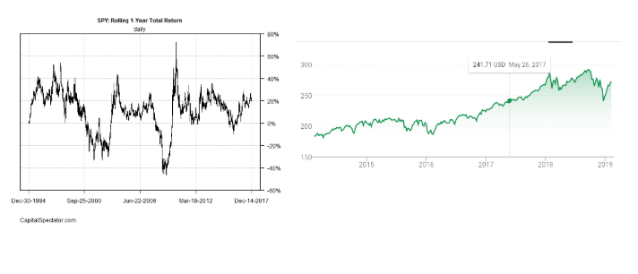
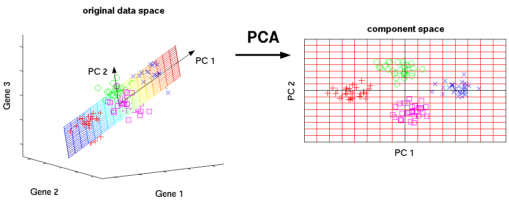

# Using Principal Component Analysis to Identify Mean Reverting Portfolios

## Traditional Mean Reversion

Traditional Mean Reversion is a strategy we deploy when we believe that a certain time series is relatively stationary. That is we believe the mean and variance are relatively constant throughout time.

Traditional Mean Reversion entails longing a security or portfolio when the returns or price ratios fall significantly below the moving average, and shorting it when the returns rise significantly above the moving average.

Notice that we use returns or price ratios and not actual price value of the security as our Mean Reverting metric. This is fair because the price of any security is likely to be affected by market trends, momentum etc. Because of their trending nature, price is not a good metric to base a mean reverting strategy off of

Notice how returns compared to price are far more stationary

Another way you can think of it, is does the time series demonstrate significant autocorrelation. That is, how correlated is one part of a time series with another section at a delayed interval

## Proposal
Price time series lacks stationarity because it is affected by larger economic and market trends. By using Principal Component Analysis (PCA) we can discard the components of our data that are responsible for the most variance, and then trade  off of the remaining components which I believe will be mean reverting.
But first ...

## AN OVERVIEW OF PCA

PCA is a dimensionality reduction method that projects potentially correlated variables as independent (orthogonal) components in a lower dimensional subspace. The basic premise of PCA is to capture as much variance in the data as possible with as few dimensions.

