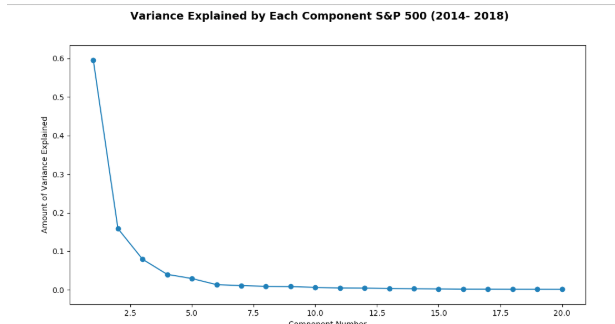
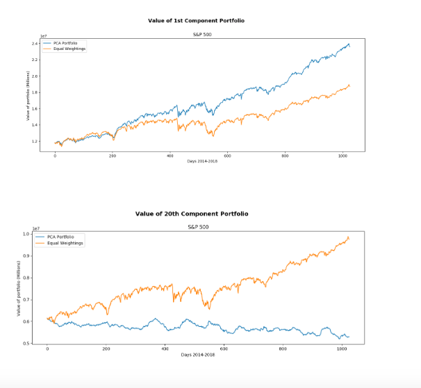
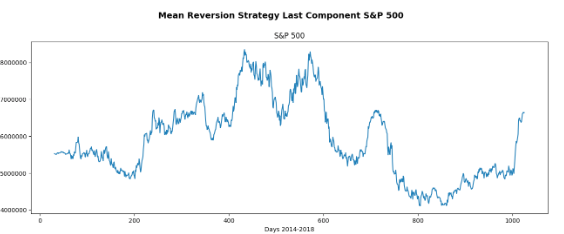
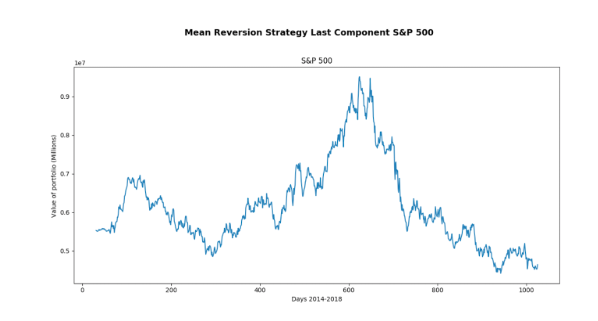

# Using Principal Component Analysis to Identify Mean Reverting Portfolios

## Traditional Mean Reversion

Traditional Mean Reversion is a strategy we deploy when we believe that a certain time series is relatively stationary. That is we believe the mean and variance are relatively constant throughout time.

Traditional Mean Reversion entails longing a security or portfolio when the returns or price ratios fall significantly below the moving average, and shorting it when the returns rise significantly above the moving average.

Notice that we use returns or price ratios and not actual price value of the security as our Mean Reverting metric. This is fair because the price of any security is likely to be affected by market trends, momentum etc. Because of their trending nature, price is not a good metric to base a mean reverting strategy off of

Notice how returns compared to price are far more stationary

Another way you can think of it, is does the time series demonstrate significant autocorrelation. That is, how correlated is one part of a time series with another section at a delayed interval

## Proposal
Price time series lacks stationarity because it is affected by larger economic and market trends. By using Principal Component Analysis (PCA) we can discard the components of our data that are responsible for the most variance, and then trade  off of the remaining components which I believe will be mean reverting.
But first ...

## AN OVERVIEW OF PCA

PCA is a dimensionality reduction method that projects potentially correlated variables as independent (orthogonal) components in a lower dimensional subspace. The basic premise of PCA is to capture as much variance in the data as possible with as few dimensions.

Notice how on the left the data is represented by 3 dimensions but most of the data is centered around a 2d plane. By using two vectors that span or describe the plan the as the axis of our new space, we can represent the data in a more condensed matter.

## HOW WE ARE GOING TO APPLY THIS

Alright so in a certain time span, we can imagine every day being a point. Each of these points live in a 500 dimensional hyperspace. (One dimension for each security in the S&P 500). That means that essentially every day or point is positioned in this space based off of the current prices of each of the 500 securities.

To help you visualize things pretend our space is just 3 dimensions. The number really doesn’t matter as much as the concept.

Okay so now we have all our day points scattered in this subspace. There might be a fair degree of scatter, but we expect that overtime, our points are moving in a positive direction in each dimension. (Each securities value tends to appreciate over time). The vector that describes this direction is nothing but a linear combination off all of our base vectors.

For example if our 3 dimensions were Apple, JP, and Caterpillar then the basis vectors would be <1,0,0>  , <0,1,0>, and <0,0,1> . The vector that describes all of the stocks increasing is <1,1,1> which is nothing but a combination of our original basis vectors.

This is what PCA will do. It will identify some x number (where we specify x) of principal components or “directions” that best describe our data. Each of these directions will be described by a vector that is built off a combination of the basis vectors. We will use the values of the direction vector as weights to determine how much to invest in each security.

## DETERMINING  WHICH COMPONENT TO USE  
Creating a rigorous way to determine the best component to use is definitely a way that I can expand this project. But keep in mind the first few components will explain the vast majority of the variance in the data.  

In essence these components should account for market trends and big drivers of the stock market.Theoretically then the components towards the end should be be quite stationary.

To validate this theory, I graphed the value of portfolios suggested by the first component and by the last one   

This validates our hypothesis. You can clearly see that the first component is highly correlated with the value of an equally weight basket. Whereas the last component is far more stationary. I ran an Augmented Dicky Fuller Test on these time series which essentially test the null hypothesis  that it is stationary.   Component 1 had a pval of .98 whereas Component 20 had a pval of .11. This affirms our statement.

I was quite honestly surprised by how well just longing the first component did. My hypothesis is that because it weights heavier into the areas that are responsible for most movement, this component essentially amplified the bull market that we saw in this time period.

## Backtest

Now that we have verified that our last component is indeed stationary we can try deploying a mean reverting strategy on it. I shorted the suggested basket when the value rose above the moving average of the portfolio by more than one standard deviation and longed when it fell more than one standard deviation below.

The result was as follows : Sharpe 2.29   

Strategy did quite well up until 2016. I do wonder what factors changed that led to the collapse in recent years. I’ll also probably want to see how the current upward trend plays out.

I thought  we might be suffering because I was running pca on the total data collected at that point, but recent data should be weighted heavier.

I tried rerunning the strategy but changing it so that we rebalanced our portfolio only on the last month of data. It performed very well during first half, but again strategy collapsed.

## Future Optimizations

I think implementing some sort of stop loss on this strategy could be helpful because we tend to lose money very quickly when we do .

Parameters to optimize in the future :  Optimizing the component to use and how many standard deviations away should I trade
