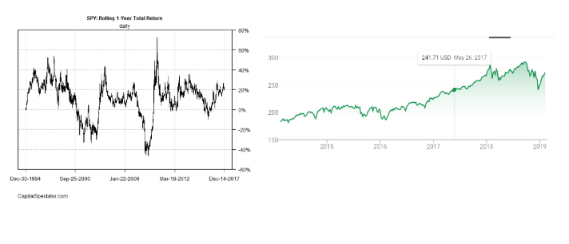

# An ML Exploration of Utility Companies  

This project was an experiment in trying to use some basic machine learning techniques to create a trading strategy that performs better than random. This isn’t a coding or a math tutorial, it is an exploration of how we might be able to work with our data to make more accurate models. I will explain whatever math and code needed, but all you need is an interest to learn more about machine learning or trading strategies. With that, let’s get started !

## Premise
We want to build a trading strategy that accurately tells us when to buy or sell stock of major Utility Companies in the S&P 500. The reason we are choosing the Utilities industry is because there is relatively little differentiation in business models and products across companies. As a result, I hypothesize that a similar set of factors are most influential for the majority of companies in this industry. In an industry like tech on the other hand, the big players each have their own specialization and set of services. Microsoft and Amazon for example, have many differences between their business models and core services, so it would be harder to train an effective model on the industry as a whole.

## Getting Data
I retrieved the monthly data for 10 of the major utility companies in the S&P500 from 2000-2015. The data included 70 factors for each month including some common ones you’ve probably heard of like the PE and PEG ratios, as well as some more obscure metrics. I retrieved the data from the Wharton Research Database.

## Prepping Data
In order to create an accurate model, we need to “teach” our program when to buy and when to sell. To do this we will train our program on a part of our data that we have labeled. When I say label, I mean for each month we are literally going to place a buy or sell signal 1 or 0 based off of the change in price  in the next month. For example if the stock goes up 3%  from the current month to the next month  that means the current month will be labeled a buy : 1 . For example :

