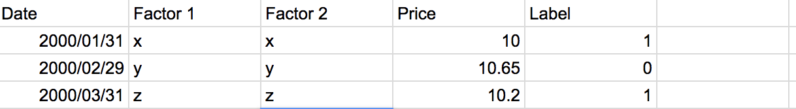
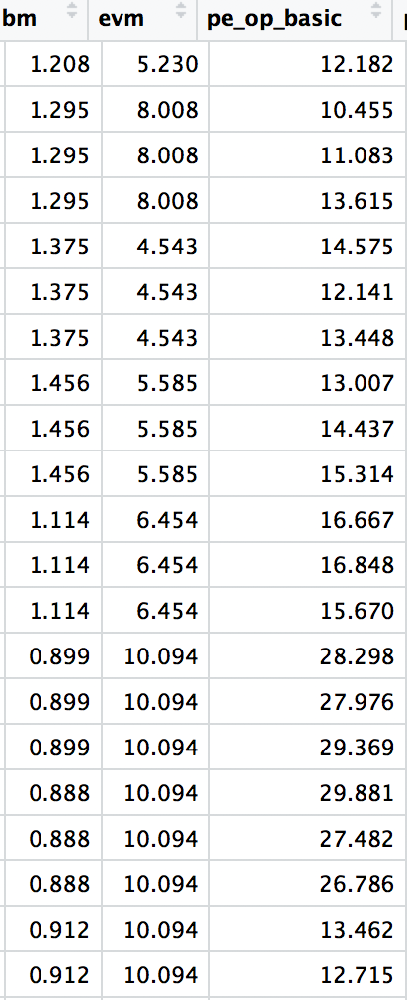
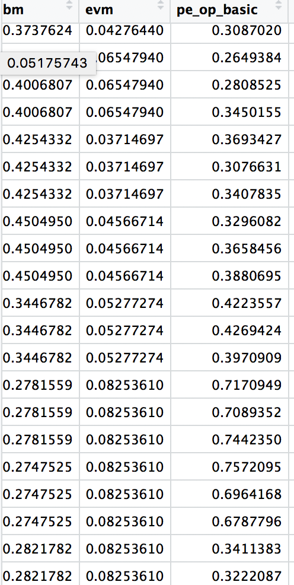
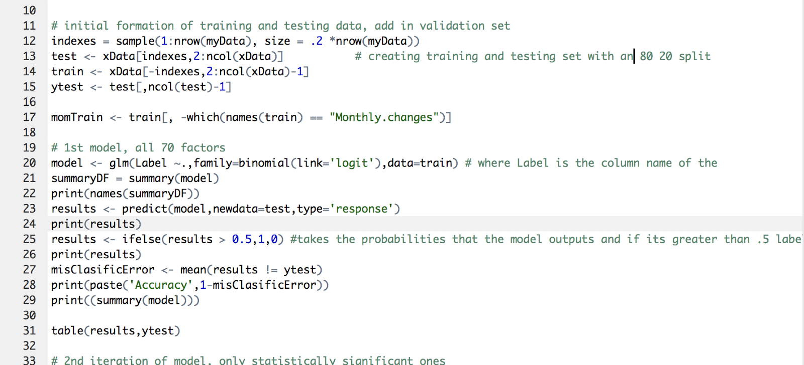

# An ML Exploration of Utility Companies  

This project was an experiment in trying to use some basic machine learning techniques to create a trading strategy that performs better than random. This isn’t a coding or a math tutorial, it is an exploration of how we might be able to work with our data to make more accurate models. I will explain whatever math and code needed, but all you need is an interest to learn more about machine learning or trading strategies. With that, let’s get started !

## Premise
We want to build a trading strategy that accurately tells us when to buy or sell stock of major Utility Companies in the S&P 500. The reason we are choosing the Utilities industry is because there is relatively little differentiation in business models and products across companies. As a result, I hypothesize that a similar set of factors are most influential for the majority of companies in this industry. In an industry like tech on the other hand, the big players each have their own specialization and set of services. Microsoft and Amazon for example, have many differences between their business models and core services, so it would be harder to train an effective model on the industry as a whole.

## Getting Data
I retrieved the monthly data for 10 of the major utility companies in the S&P500 from 2000-2015. The data included 70 factors for each month including some common ones you’ve probably heard of like the PE and PEG ratios, as well as some more obscure metrics. I retrieved the data from the Wharton Research Database.

## Prepping Data
In order to create an accurate model, we need to “teach” our program when to buy and when to sell. To do this we will train our program on a part of our data that we have labeled. When I say label, I mean for each month we are literally going to place a buy or sell signal 1 or 0 based off of the change in price  in the next month. For example if the stock goes up 3%  from the current month to the next month  that means the current month will be labeled a buy : 1 . For example :

Just keep in mind that the actual data set we have 70 different factors and a dozen or so companies.  We will be storing all this labeled data in an output file simply named “outCopy.csv”  

One thing is left before we start building models, we need to normalize our data.  Currently you see that each factor is on a widely  different scale. pe_op_basic fluctuates between 10 and 15 while bm really stays at around 1.1-1.4, meaning that even small changes in it are potentially a big deal. However, the computer just sees numbers and as a result  may put undue weight on pe_op_basic as a factor in its prediction, simply because its numbers are larger. To avoid this we will subtract every value in each column by the minimum of that column and divide that value by the max of col - min col

   

Taking data on right and normalizing it on a 0-1 scale (left) will allow our modell to optimize the parameters more accurately. This will also be very important when we conduct dimensionality reduction later on. 

We are going to reserve the last 3 years of data we have as our test set. The years before we are going to do an 80:20 split to get our training and validation set. Our training set will as the name suggests "train" our model and tune the parameters. Our models that do the best on the validation, will then be backtested on our test set to see their profitability.

## First Model 
Finally we can start talking about our first model. We are faced with a binary classification problem. We want the computer to predict, based off the factors of that month, a buy signal (1) or a sell signal (0). Lets look in our toolbox. A linear regression wouldn’t make sense because it predicts continuous y values based on our x parameters. We want to in essence “cap” the regression so it can only predict a 0 or a 1. 

To illustrate the difference between linear and logistic regression, let  x be our vector of parameters (PEG ratio, PE ratio, etc) and 𝛳 be the vector of weights for each of those parameters. 

**Linear Regression**
 - h𝛳(x)=𝛳^Tx  where h𝛳(x) is some y value 
**Logistic Regression** 
- h𝛳(x) = p(y=1 | x;𝛳) That is our value is the probability that y = 1 ( a buy in our case) given the factors x which have weights 𝛳
- A logistic regression is the same as a linear regression except h𝛳(x)= g(𝛳Tx) = g(x) where g is the sigmoid function 1/  (1 + e^-x) 

  

We run the code and get the following results: 
   

Not bad, after just 30 lines of code, our model is already predicting better than random. But don’t get your hopes up, all those 48% times where we make the wrong call is where we can lose big money. Plus it looks like our model is missing a lot of sell calls. 98 times we predicted a buy when it should have been a sell. Let’s try to push this thing and really see how accurate we can be. 

## Second Model: Significant Factors 
My concern is that of the 70 factors, a lot of them are just noise that are cluttering our model. If we can isolate the most useful factors and train our model off of those, perhaps we can get better results.

With the handy summary command in r, we automatically get a list of all the factors and their p-values in our original model. P-value being the probability that the specific factor has a weight of zero and had no effect in the regression. The factors with low p-values <.05 are statistically significant and as a result have large coefficients or 𝛳 values in the regression. We are going to be using only those statistically significant factors in our second regression 

 

Before we run the original model on these significant factors, I would like to note something interesting. The factors that the model declared significant were as follows : 

- Debt to EBITDA 
- Earned Value Management 
- Total Debt to Invested Capital 
- Debt to Assets 
- Long Term Debt : Equity 
- Cash to Debt 
- Debt to Assets
- Debt to Capital 
- Price to Sales 
- Price/Earnings to Growth
- Price to Earnings Basic
- Price to Earnings Diluted
- Asset Turnover Ratio
- % Monthly Change 

